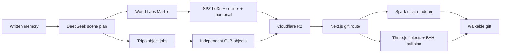

# Lantern

**Build someone the place they remember.**

Lantern turns a written memory into a shareable place: World Labs Marble builds
the environment, Tripo builds the remembered objects, and a browser viewer lets
the recipient enter, look around, and walk through it.

**Tripothon S1 · Direction 04 — App**

[Open Lantern](https://lantern-manuel-dev01s-projects.vercel.app) ·
[Architecture](docs/ARCHITECTURE.md) ·
[Demo and capture](docs/DEMO.md) ·
[Storage](docs/STORAGE.md) ·
[Deployment](docs/DEPLOY.md)

## Contents

- [Judge path](#judge-path)
- [What Lantern proves](#what-lantern-proves)
- [How it works](#how-it-works)
- [Controls](#controls)
- [Tripothon fit](#tripothon-fit)
- [Run locally](#run-locally)
- [Configuration](#configuration)
- [Useful commands](#useful-commands)
- [Quality gates](#quality-gates)
- [Documentation map](#documentation-map)
- [Honest constraints](#honest-constraints)

## Judge path

The shortest complete tour is about five minutes and needs no account.

1. **Read the proposition.** Open the [landing page](https://lantern-manuel-dev01s-projects.vercel.app).
   The room behind the headline is a real, gently moving splat on capable
   desktop hardware; the page remains complete when the renderer is skipped.
2. **Receive a gift.** Open [the sewing room](https://lantern-manuel-dev01s-projects.vercel.app/g/Z1MV55219C),
   read the threshold, then choose **step inside**.
3. **Walk the memory.** Click once, use **WASD**, and move around the independent
   Tripo objects inside the Marble environment. Press **Esc** to release the
   cursor.
4. **Compare a second world.** Open [the Lagos kitchen](https://lantern-manuel-dev01s-projects.vercel.app/g/1KAJZTJBK1).
   It demonstrates progressive splat loading, surface-aware object seating,
   collision, and depth occlusion.
5. **Follow the making flow.** Open [Make a place](https://lantern-manuel-dev01s-projects.vercel.app/make).
   The three prompts are intentionally the whole interface. A full-quality
   generation is asynchronous and can take several minutes.
6. **See the format, not one demo.** Finish at the [Constellation](https://lantern-manuel-dev01s-projects.vercel.app/constellation),
   which contains only gifts whose senders explicitly chose to share them.

For reproducible evidence frames and the required walkthrough/asset-board
workflow, see [docs/DEMO.md](docs/DEMO.md).

## What Lantern proves

Most generated memories stop at an image. Lantern makes the image spatial and
gives it the etiquette of a gift:

- the recipient opens one link, sees their name, and decides when to enter;
- the place streams from a light preview to the full-resolution splat without
  resetting the camera;
- remembered objects remain real meshes that can be placed, approached, and
  occluded by the generated room;
- the same measured collider grounds the visitor, supports objects, and writes
  depth for the splat/mesh composite;
- sharing is opt-in after the sender has seen the result.

## How it works



The build pipeline is asynchronous and idempotent. A gift advances through:

```text
world_generating → world_mirroring → objects_generating → rigging → ready
```

Every tick performs one bounded unit of work. Leases prevent the browser,
server continuation, and Railway worker from starting the same paid job twice.
Provider URLs are never sent to a visitor; assets are mirrored to R2 first and
served through same-origin `/worlds/*` and `/gifts/*` paths so Spark's range
requests work without CORS preflights.

See [docs/ARCHITECTURE.md](docs/ARCHITECTURE.md) for the complete data flow,
failure model, rendering pipeline, and directory map.

## Controls

| Platform | Look | Move | Other |
|---|---|---|---|
| Desktop | click to capture pointer, move mouse | WASD or arrows; Shift to move faster | Space jumps; Esc releases pointer |
| Touch | drag the right half | drag the left half from any starting point | on-screen stick follows the thumb |

The viewer deliberately keeps visitors near the viewpoint where the generated
splat is reliable. The collider may contain distant geometry that is physically
valid but visually under-reconstructed; it is not used as a quality boundary.

## Tripothon fit

Lantern targets **Direction 04 — App**: an AI-native web product and interactive
creative tool. The competition asks for a playable demo, a walkthrough rather
than only a trailer, and a visual asset board; all three have explicit,
reproducible paths in [docs/DEMO.md](docs/DEMO.md).

| Criterion | Lantern evidence |
|---|---|
| Creativity · 30% | a remembered place is delivered with the ritual of a gift, not as an asset folder |
| Completeness · 25% | intake, asynchronous generation, recipient reveal, exploration, sharing, gallery, recovery paths |
| Theme fit · 20% | the product literally builds a world as a gift for another person |
| Viral potential · 15% | every result is one recipient-specific link; shared gifts can join the Constellation |
| Commercial value · 10% | a repeatable consumer creation flow with bounded provider work and durable storage |

The tool contribution is structural rather than decorative: Marble owns the
place, Tripo owns the remembered things, and DeepSeek translates personal prose
into prompts each system can execute.

## Run locally

Requirements: **Node.js 24+**, npm, and provider credentials for generation.
Viewing checked-in manifests can work without provider keys when their mirrored
assets are already available.

```powershell
npm install
Copy-Item .env.example .env.local
npm run dev
```

Open [http://localhost:3000](http://localhost:3000).

World binaries are intentionally not committed. A fresh clone can build the
application, while generated `.spz`, collider `.glb`, thumbnails, and object
meshes live in Cloudflare R2. See [docs/STORAGE.md](docs/STORAGE.md).

## Configuration

| Variable | Used by | Purpose |
|---|---|---|
| `WORLDLABS_API_KEY` | app | Marble world generation and polling |
| `TRIPO_API_KEY` | app | isolated object generation and rig probes |
| `DEEPSEEK_API_KEY` | app | memory-to-world/object planning |
| `R2_ACCOUNT_ID` | app + worker | Cloudflare account endpoint |
| `R2_ACCESS_KEY_ID` | app + worker | R2 object access |
| `R2_SECRET_ACCESS_KEY` | app + worker | R2 object access |
| `R2_BUCKET` | app + worker | asset/document bucket |
| `R2_PUBLIC_URL` | app + deployment | public asset origin behind same-origin rewrites |
| `LANTERN_BASE_URL` | worker/capture | deployed app to drive or capture |

Never commit `.env`, `.env.local`, provider responses containing credentials, or
temporary signed URLs.

## Useful commands

| Command | Purpose |
|---|---|
| `npm run dev` | local Next.js server |
| `npm run worker` | drive unfinished gifts independently of an open browser |
| `npm run gift:drive` | manually advance unfinished gifts |
| `npm run gift:probe -- <id> <collider.glb>` | inspect what lies under an object point |
| `npm run gift:seating -- <id> <collider.glb> <objects-dir>` | run the real seating code against real meshes |
| `npm run gift:spawn -- <id> <collider.glb>` | verify a supported arrival point |
| `npm run gift:surfaces -- <id> <collider.glb> [radius] [height]` | find footprint-safe furniture surfaces |
| `npm run gift:tune -- <id> ...` | dry-run capture-safe FOV/radius/target tuning; add `--write` to save |
| `npm run world:hero -- <worldId>` | upload only a hero splat and thumbnail |
| `npm run capture:board -- all` | capture the required evidence stills with system Chrome |
| `npm run capture:compose` | assemble the visual asset board |
| `npm run video:launch -- preview\|90\|300` | render the 18s preview, 90s launch film, or 5min walkthrough |

## Quality gates

Run all three before a release:

```powershell
npm run sweep
npx tsc --noEmit
npm run build
```

`sweep` must report **0 finding(s)**. For PowerShell, use the process exit code
directly; when piping on POSIX shells, check the build process rather than
`tail` (`${PIPESTATUS[0]}`).

Do not judge Gaussian-splat quality from a headless software-rendered
screenshot. The capture tools use installed system Chrome and reject
SwiftShader; final visual approval still requires a human looking at a GPU
render.

## Documentation map

| Document | What it owns |
|---|---|
| [Architecture](docs/ARCHITECTURE.md) | components, data model, state machine, rendering, reliability, privacy |
| [Demo](docs/DEMO.md) | judge walkthrough, video sources, asset-board capture, verification |
| [Narration](docs/DEMO-NARRATION.md) | tracked five-minute narration master |
| [Capture plan](docs/CAPTURE.md) | reproducible GPU stills and exact evidence frames |
| [Deployment](docs/DEPLOY.md) | Vercel application and R2 asset delivery |
| [Storage](docs/STORAGE.md) | Cloudflare R2 setup and invariants |
| [Worker](docs/WORKER.md) | Railway continuation worker and leases |
| [Audit](docs/AUDIT.md) | open risks and repaired failure modes |
| [Strategy/build log](docs/STRATEGY.md) | design decisions, measurements, and implementation history |

## Honest constraints

- A Gaussian splat is a view-dependent reconstruction, not a watertight 360°
  polygon world. Lantern constrains walking to a capture-safe region; a poor
  generation can still need regeneration or human framing.
- Full-resolution worlds are large. A lighter LoD opens first, and the UI says
  when detail is still enhancing underneath.
- Generation uses paid third-party APIs and takes minutes. The demo never
  fabricates a completed generation, recipient reaction, click, or transaction.
- The presentation cursor in rendered demo videos is reconstructed and labelled
  as editorial; it is not evidence that an interaction happened.
