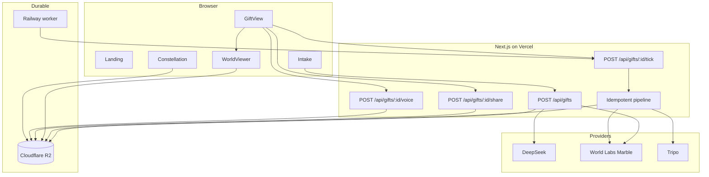
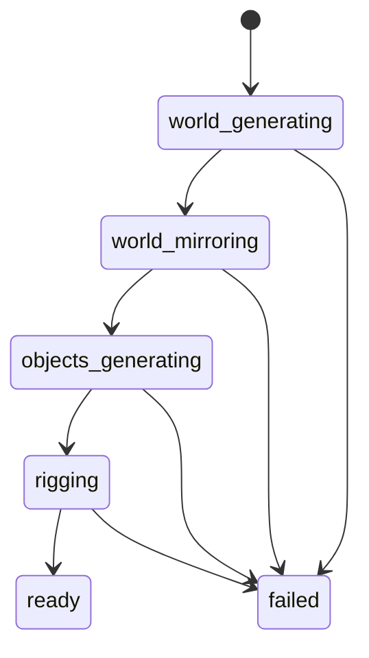

# Lantern architecture

This document explains the production system behind Lantern: how a memory
becomes a durable gift, how Marble splats and Tripo meshes share one viewer, and
how the pipeline survives slow paid providers without double-spending work.

## Contents

- [System goals](#system-goals)
- [System map](#system-map)
- [Product routes](#product-routes)
- [Creation pipeline](#creation-pipeline)
- [Data and storage](#data-and-storage)
- [Viewer and rendering](#viewer-and-rendering)
- [Collision, placement, and capture safety](#collision-placement-and-capture-safety)
- [Performance model](#performance-model)
- [Reliability and failure recovery](#reliability-and-failure-recovery)
- [Privacy and trust](#privacy-and-trust)
- [Deployment](#deployment)
- [Repository map](#repository-map)
- [Verification](#verification)

## System goals

Lantern optimizes for five invariants:

1. A recipient opens one link and can understand it without an account.
2. A generated result remains available after provider URLs expire.
3. Every paid or slow pipeline step is resumable and safe to repeat.
4. The world remains usable while large visual assets are still arriving.
5. Evidence in the product and demo is real or explicitly labelled editorial.

## System map



## Product routes

| Route | Responsibility |
|---|---|
| `/` | proposition, real hero world, selected public gifts |
| `/make` | three-step memory intake |
| `/g/[id]` | recipient threshold, build progress, world viewer, sharing |
| `/constellation` | opt-in public gift cards |
| `POST /api/gifts` | plan and start a gift |
| `POST /api/gifts/[id]/tick` | advance one bounded pipeline operation |
| `POST /api/gifts/[id]/share` | add or remove a gift from the public index |
| `POST /api/gifts/[id]/voice` | store a sender's spatial voice note |

The landing hero is intentionally not `WorldViewer`. It has no collider,
controls, pointer events, progress UI, or LoD ladder; it exists only as ambient
proof behind the sentence and removes itself on weak hardware.

## Creation pipeline

### 1. Plan

`planGift` asks DeepSeek for strict JSON containing one 60–90 word environment
prompt and three to six isolated object prompts. Validation runs in application
code because the provider does not support the schema response mode used by the
initial prototype.

The environment instructions require no people, one place and time, continuous
major surfaces, a clear arrival patch, and coherent surroundings. Object prompts
describe one physical item with no scene or background.

### 2. Generate the world

The application starts a World Labs Marble operation and immediately stores its
operation id. Full generation can take minutes, so no request waits for the
world to finish.

### 3. Mirror the world

When Marble finishes, Lantern mirrors:

- the offered `.spz` Gaussian levels of detail;
- the collider `.glb`;
- the thumbnail;
- the provider caption.

The collider is measured while its bytes are already in memory. Bounds, a
supported spawn, floor height, initial target, FOV, and capture-safe walking
radius become part of the durable `World` manifest.

### 4. Build objects

Tripo object jobs are staggered rather than launched as a burst because the
provider limits concurrent generation. Successful GLBs are mirrored immediately
before their signed URLs expire. Mesh bounds are measured once and stored with
the gift.

### 5. Place and optionally rig

`placeObjects` makes an inexpensive initial arrangement from measured bounds.
At runtime the authoritative `seatObject` path uses the real collider BVH and
the real object mesh. Rig checks are best-effort and can never fail a gift.

### 6. Open the gift

The final state machine is:



## Data and storage

### Gift document

`Gift` is the durable job and product record. It contains sender/recipient data,
the memory, provider operation ids, stage, object task state, mirrored asset
paths, measured bounds, and the finished `World` manifest.

### World manifest

`World` contains only what a viewer needs:

- splat URL and available LoDs;
- collider URL;
- measured bounds, spawn, floor, target, FOV, exploration radius;
- independent object transforms and optional audio;
- caption, thumbnail, and names.

### Object store

Cloudflare R2 holds both gift JSON documents and immutable binary assets. The
application reads documents through the S3 API for read-after-write consistency.
Browser assets use stable app-relative URLs. `vercel.ts` rewrites `/worlds/*`
and `/gifts/*` to the bucket's public host while keeping requests same-origin
from the viewer's perspective.

This is required for Spark: splat loading uses HTTP range requests, and direct
cross-origin range requests would require CORS preflights that the public asset
host does not reliably satisfy.

## Viewer and rendering

`WorldViewer.tsx` owns one Three.js scene:

- `SparkRenderer` and `SplatMesh` draw the selected `.spz` capture;
- `GLTFLoader` draws independent Tripo objects;
- a depth-only collider pass lets real meshes disappear behind splat geometry;
- `FirstPersonController` supplies desktop and touch navigation;
- `MeshBVH` accelerates collision, floor probes, and surface seating;
- positional audio attaches a sender recording to an object.

The splat uses Marble's coordinate convention correction. Collider and object
transforms are kept in the same frame; changing one without the others creates
the familiar symptom of visible geometry and invisible physics disagreeing.

### Progressive detail

The viewer selects a light initial LoD based on device/network capability, then
loads sharper levels in place. The current camera is preserved during the swap.
The UI labels the period as **enhancing this room** instead of presenting the
soft preview as a finished result.

## Collision, placement, and capture safety

These are three related but distinct questions:

| Question | Source of truth |
|---|---|
| Can the visitor stand here? | collider triangles + capsule collision |
| Can the object rest here? | BVH surface probes under its footprint |
| Does the splat look reliable here? | capture viewpoint + curated exploration radius |

A collider can include distant skyline, reflected, or low-confidence geometry.
That geometry may be physically measurable while the corresponding Gaussian
view stretches into sheets when approached from a novel angle. Lantern therefore
does not equate collider bounds with visual validity.

New worlds receive a conservative `explorationRadius` around the verified spawn
and a 55° arrival lens. Curated gifts can tune `cameraFov`, `target`, and radius
without regenerating paid assets:

```powershell
npm run gift:tune -- <giftId> --fov 52 --radius 1.1 --target 0.4,0,-2 --write
```

The controller still allows unrestricted looking, but walking stops at the
capture-safe boundary. If the source generation itself has a central hole or
severe smear, tuning is not a repair; that world must be regenerated.

Object support is stricter than a centre ray. Multiple footprint probes must
agree on a surface, then the underside is placed exactly on it. Offline probes
must report `gap to floor 0.0000` before a placement change is accepted.

## Performance model

- Splat LoDs stream from smallest to sharpest.
- Renderer pixel ratio is capped.
- Collider parsing and BVH creation happen once per world.
- Physics uses fixed 120 Hz substeps to avoid tunnelling at low render rates.
- The landing hero renders at 20 fps, pauses off-screen/hidden, skips coarse or
  low-core devices, and removes itself after repeated very slow frames.
- World binaries are CDN-cacheable and immutable; mutable gift JSON is read
  server-side from R2.

## Reliability and failure recovery

`advance()` performs one small, idempotent transition. The gift records every
provider task id and every mirrored asset, so a retry resumes rather than pays
for another generation.

Three drivers may ask for progress:

1. the recipient/sender browser;
2. a Next.js `after()` continuation;
3. the Railway worker.

A soft lease narrows races between them. Provider calls are retried only where
safe and are bounded. Tripo object failure degrades to fewer objects; failure of
the environment fails the gift honestly. A missing or unsafe collider keeps a
safe provisional floor instead of dropping the visitor through the world.

## Privacy and trust

- Gift ids use a non-ambiguous ~50-bit alphabet and are not sequential.
- Memories are not published to the Constellation.
- Sharing is off by default and is requested only after the sender sees the
  generated result.
- Provider URLs and secrets remain server-side.
- Demo evidence labels debug views and reconstructed cursors.
- No UI claims a successful generation, share, payment, or recipient reaction
  unless that action actually happened.

## Deployment

- **Vercel** runs the Next.js application and same-origin asset rewrites.
- **Cloudflare R2** stores mutable gift documents and immutable assets.
- **Railway** runs the stateless continuation worker.

See [DEPLOY.md](DEPLOY.md), [STORAGE.md](STORAGE.md), and [WORKER.md](WORKER.md)
for operational steps.

## Repository map

```text
src/app/                    routes, metadata, API endpoints
src/components/             intake, gift shell, viewer, landing experience
src/lib/pipeline.ts         durable generation state machine
src/lib/firstPerson.ts      scale-independent movement and collision
src/lib/seating.ts          real-mesh object support and orientation
src/lib/providers/          World Labs, Tripo, R2, GLB/collider utilities
data/worlds/                committed curated manifests (not binaries)
scripts/                    probes, workers, capture, rendering, maintenance
docs/                       architecture, operations, demo and build record
public/worlds/              local generated binaries; intentionally ignored
shots/                      generated captures/videos; intentionally ignored
```

## Verification

```powershell
npm run sweep       # expected: 0 finding(s)
npx tsc --noEmit    # expected: no output, exit 0
npm run build       # expected: exit 0
```

Placement and spawn changes require the real collider and real object meshes:

```powershell
npm run gift:spawn -- <giftId> <collider.glb>
npm run gift:probe -- <giftId> <collider.glb>
npm run gift:seating -- <giftId> <collider.glb> <objects-dir>
```

Visual splat approval must happen in system Chrome with a real GPU. Headless
software rendering is useful for DOM and HTTP checks, not for judging splat
clarity.
